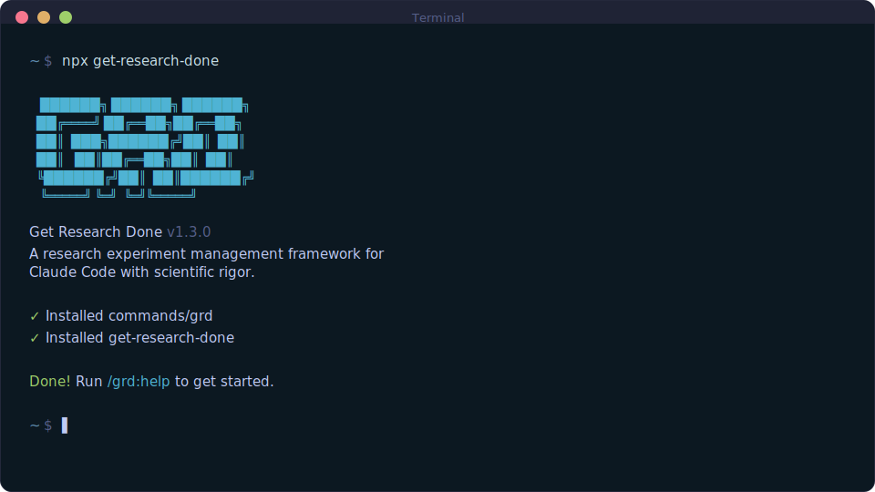

<div align="center">

# GET RESEARCH DONE (GRD)

**A recursive, agentic framework for ML research with hypothesis-driven experimentation for Claude Code.**

**Structured ML experimentation with scientific rigor — from hypothesis to validated conclusion, with a Critic agent enforcing skepticism at every step.**

[](https://www.npmjs.com/package/get-research-done)
[](https://www.npmjs.com/package/get-research-done)
[](https://github.com/ulmentflam/get-research-done)
[](LICENSE)

<br>

```bash
npx get-research-done
```

**Works on Mac, Windows, and Linux.**

<br>



<br>

*"If you know clearly what you want, this WILL build it for you. No bs."*

*"I've done SpecKit, OpenSpec and Taskmaster — this has produced the best results for me."*

*"By far the most powerful addition to my Claude Code. Nothing over-engineered. Literally just gets research done."*

<br>

**Trusted by engineers at Amazon, Google, Shopify, and Webflow.**

[Why I Built This](#why-i-built-this) · [How It Works](#how-it-works) · [Commands](#commands) · [Why It Works](#why-it-works)

</div>

---

## Why I Built This

ML research has a reproducibility crisis. Experiments are ad-hoc, hypotheses are vague, validation is subjective, and insights get lost.

I've watched researchers spend weeks on experiments with fundamental flaws: data leakage baked into features, "95% accuracy" on shifted distributions, negative results deleted rather than preserved. The problem isn't capability — it's structure.

So I built GRD. It's the framework that makes ML research systematic:

- **Data-first philosophy** — Explore your data before forming hypotheses
- **Testable hypotheses** — Falsification criteria, success metrics, baseline requirements
- **Automated skepticism** — Critic agent catches leakage, overfitting, and logical errors
- **Recursive validation** — Results contradict the data? System routes back to exploration
- **Human-in-the-loop gates** — You make final calls on validation and archival
- **Negative result preservation** — Failed hypotheses are valuable knowledge

The complexity is in the system, not in your workflow. You run five commands: `/grd:explore`, `/grd:architect`, `/grd:research`, `/grd:evaluate`, `/grd:graduate`. The agents handle the rest.

— **Ulmentflam**

---

## What's New in v1.3

- **Gemini CLI Support** - Native support for Google's Gemini CLI with automatic TOML agent conversion
- **Multi-Runtime Installer** - Install to Claude Code, OpenCode, and/or Gemini CLI with `--claude`, `--opencode`, `--gemini`, or `--all` flags
- **Visual Branding Refresh** - Updated GRD identity with research teal color palette

See [CHANGELOG.md](CHANGELOG.md) for full version history.

---

## Who This Is For

ML researchers and practitioners who want structured experimentation with hypothesis-driven workflows — without building custom research infrastructure from scratch.

---

## Getting Started

```bash
npx get-research-done
```

The installer prompts you to choose:
1. **Runtime** — Claude Code, OpenCode, Gemini CLI, or multiple
2. **Location** — Global (all projects) or local (current project only)

Verify with `/grd:help` inside your Claude Code or OpenCode interface.

### Staying Updated

GRD evolves fast. Update periodically:

```bash
npx get-research-done@latest
```

<details>
<summary><strong>Non-interactive Install (Docker, CI, Scripts)</strong></summary>

```bash
# Claude Code
npx get-research-done --claude --global   # Install to ~/.claude/
npx get-research-done --claude --local    # Install to ./.claude/

# OpenCode (open source, free models)
npx get-research-done --opencode --global # Install to ~/.opencode/

# Gemini CLI
npx get-research-done --gemini --global   # Install to ~/.gemini/

# Multiple runtimes
npx get-research-done --both --global     # Claude Code + OpenCode
npx get-research-done --all --global      # All runtimes (Claude Code + OpenCode + Gemini)
```

Use `--global` (`-g`) or `--local` (`-l`) to skip the location prompt.
Use `--claude`, `--opencode`, `--gemini`, `--both`, or `--all` to skip the runtime prompt.

</details>

<details>
<summary><strong>Gemini CLI Setup</strong></summary>

GRD supports [Gemini CLI](https://github.com/google-gemini/gemini-cli) as an alternative runtime.

**1. Get an API key:**

Visit [Google AI Studio](https://aistudio.google.com/apikey) to create a free API key.

**2. Set environment variable:**

```bash
export GEMINI_API_KEY="your-api-key"
```

Add this to your shell profile (`~/.zshrc`, `~/.bashrc`) for persistence.

**3. Install GRD for Gemini:**

```bash
npx get-research-done --gemini --global
```

**When to use Gemini vs Claude:**
- **Claude Code** — Complex reasoning, intricate code generation, nuanced analysis
- **Gemini CLI** — Cost efficiency, multimodal tasks (images, audio), large context windows

See the [Gemini CLI documentation](https://github.com/google-gemini/gemini-cli#authentication) for full setup details.

</details>

<details>
<summary><strong>Development Installation</strong></summary>

Clone the repository and run the installer locally:

```bash
git clone https://github.com/ulmentflam/get-research-done.git
cd get-research-done
node bin/install.js --claude --local
```

Installs to `./.claude/` for testing modifications before contributing.

</details>

### Recommended: Skip Permissions Mode

GRD is designed for frictionless automation. Run Claude Code with:

```bash
claude --dangerously-skip-permissions
```

> [!TIP]
> This is how GRD is intended to be used — stopping to approve `date` and `git commit` 50 times defeats the purpose.

<details>
<summary><strong>Alternative: Granular Permissions</strong></summary>

If you prefer not to use that flag, add this to your project's `.claude/settings.json`:

```json
{
  "permissions": {
    "allow": [
      "Bash(date:*)",
      "Bash(echo:*)",
      "Bash(cat:*)",
      "Bash(ls:*)",
      "Bash(mkdir:*)",
      "Bash(wc:*)",
      "Bash(head:*)",
      "Bash(tail:*)",
      "Bash(sort:*)",
      "Bash(grep:*)",
      "Bash(tr:*)",
      "Bash(git add:*)",
      "Bash(git commit:*)",
      "Bash(git status:*)",
      "Bash(git log:*)",
      "Bash(git diff:*)",
      "Bash(git tag:*)"
    ]
  }
}
```

</details>

---

## How It Works

GRD follows a recursive validation loop: **Explore → Architect → Research → Evaluate → Graduate**. The Critic agent enforces skepticism at every step, routing experiments back to earlier phases when issues are detected.

> **Already have ML code?** Run `/grd:map-codebase` first. It spawns parallel agents to analyze your models, datasets, metrics, and experiment patterns. Then `/grd:new-project` knows your research context.

### 1. Data Reconnaissance

```
/grd:explore ./data/train.csv
```

**Understand your data before forming hypotheses.**

The Explorer agent profiles your dataset:

- **Distributions** — Feature statistics, class balance, outliers
- **Missing data patterns** — MCAR/MAR/MNAR analysis
- **Leakage detection** — High-confidence warnings for temporal/feature leakage
- **Data quality** — Anomalies that could invalidate experiments

The output grounds all downstream work in data reality.

**Creates:** `.planning/DATA_REPORT.md`

---

### 2. Hypothesis Synthesis

```
/grd:architect
```

**Transform data insights into testable hypotheses.**

The Architect agent reads your DATA_REPORT.md and proposes hypotheses with:

- **Testable claims** — What you're trying to prove
- **Success metrics** — Weighted metrics with thresholds
- **Falsification criteria** — What would disprove the hypothesis
- **Baseline requirements** — What you're comparing against

The Architect collaborates iteratively — propose, explain reasoning, refine based on your feedback.

**Creates:** `.planning/OBJECTIVE.md`

---

### 3. Recursive Validation Loop

```
/grd:research baseline
```

**Implement experiments with automated skeptical review.**

The Researcher agent:

1. **Creates isolated run** — `experiments/run_001_baseline/` with complete snapshot
2. **Implements experiment** — Code, config, data references
3. **Spawns Critic** — Automated skeptic reviews for logical errors, leakage, overfitting

The Critic returns one of four verdicts:

| Verdict | Meaning | Routing |
|---------|---------|---------|
| `PROCEED` | Logic sound, results align with data | → Evaluator |
| `REVISE_METHOD` | Logical error, bad hyperparams | → Back to Researcher |
| `REVISE_DATA` | Anomalous results, potential leakage | → Back to Explorer |
| `ESCALATE` | Ambiguous failure | → Human decision |

If `REVISE_METHOD`, continue with:
```
/grd:research --continue
```

The loop iterates until PROCEED (default limit: 5 iterations).

**Creates:** `experiments/run_NNN/` with code, config, logs, `CRITIC_LOG.md`, `SCORECARD.json`

---

### 4. Human Evaluation Gate

```
/grd:evaluate
```

**Review evidence and make the final call.**

After Critic approves and Evaluator benchmarks, you see the evidence package:

- **SCORECARD.json** — Quantitative metrics vs thresholds
- **CRITIC_LOG.md** — What passed validation and why
- **OBJECTIVE.md** — Original hypothesis for comparison
- **DATA_REPORT.md** — Data characteristics for context

Three decisions:

| Decision | Meaning | Next Step |
|----------|---------|-----------|
| **Seal** | Hypothesis validated | Ready for production/publication |
| **Iterate** | Continue experimenting | `/grd:research --continue` |
| **Archive** | Abandon hypothesis | Preserved as negative result |

Archived hypotheses are kept in `experiments/archive/` — negative results are valuable too.

**Creates:** `DECISION.md`, `human_eval/decision_log.md`

---

### 5. Notebook Graduation

```
/grd:graduate notebooks/exploration/baseline.ipynb
```

**Convert validated notebooks to production scripts.**

After a notebook passes Critic validation:

1. **Validates requirements** — Random seeds set, parameters cell tagged
2. **Converts to Python** — Via nbconvert with metadata header
3. **Places in `src/experiments/`** — Ready for production use
4. **Generates refactoring checklist** — Manual cleanup guide

**Creates:** `src/experiments/{script_name}.py`

---

### The Recursive Loop in Action

```
/grd:explore ./data/           # Profile data
/grd:architect                  # Form hypothesis
/grd:research baseline          # Implement + Critic review
  → REVISE_METHOD              # Critic finds issue
/grd:research --continue        # Fix and retry
  → PROCEED                    # Critic approves
/grd:evaluate                   # Human reviews evidence
  → Seal                       # Hypothesis validated
/grd:graduate notebook.ipynb    # Graduate to script
```

The power is in the routing. If results contradict the data profile, `REVISE_DATA` sends you back to `/grd:explore`. The system is self-correcting.

---

## Why It Works

### Data-First Philosophy

ML research fails when hypotheses aren't grounded in data reality. GRD enforces **data reconnaissance before hypothesis formation**:

1. **Explorer** profiles your data — distributions, outliers, class balance, leakage risks
2. **Architect** reads DATA_REPORT.md before proposing hypotheses
3. **Critic** validates experiments against data characteristics

No more "95% accuracy" on shifted distributions. No more spending weeks on experiments with data leakage baked in.

### Recursive Validation Loop

Research is non-linear. Results often invalidate assumptions. GRD's Critic agent has **three exit paths**:

| Exit Code | Meaning | Routing |
|-----------|---------|---------|
| `PROCEED` | Logic sound, aligns with data | → Evaluator → Human gate |
| `REVISE_METHOD` | Logical error, bad approach | → Back to Researcher |
| `REVISE_DATA` | Data quality concern | → Back to Explorer |

When results contradict the data profile, the system forces a return to the data layer. This is the core innovation over linear workflow tools.

### Context Engineering

GRD structures context so Claude can reason effectively:

| Artifact | Purpose |
|----------|---------|
| `DATA_REPORT.md` | Living data profile — distributions, leakage warnings, anomalies |
| `OBJECTIVE.md` | Testable hypothesis — what, why, metrics, falsification criteria |
| `CRITIC_LOG.md` | Validation history — verdicts, confidence, recommendations |
| `SCORECARD.json` | Quantitative results — metrics vs thresholds, composite score |
| `experiments/run_NNN/` | Isolated snapshots — code, config, logs, outputs per iteration |

Each run is a complete, reproducible snapshot. No context rot. No lost experiments.

### Agent Roles

| Agent | Responsibility | Output |
|-------|----------------|--------|
| **Explorer** | Data reconnaissance, leakage detection | `DATA_REPORT.md` |
| **Architect** | Hypothesis synthesis, success criteria | `OBJECTIVE.md` |
| **Researcher** | Implementation, experiment execution | `experiments/run_NNN/` |
| **Critic** | Skeptical validation, routing decisions | `CRITIC_LOG.md` |
| **Evaluator** | Quantitative benchmarking | `SCORECARD.json` |
| **Graduator** | Notebook-to-script conversion | `src/experiments/` |

The Researcher spawns Critic automatically. You don't orchestrate — you just run `/grd:research` and the loop handles itself.

### Human-in-the-Loop Gates

Automated skepticism catches obvious errors. But **humans make final calls**:

- **Low confidence PROCEED** — Critic shows concerns, you decide whether to continue
- **Iteration limit reached** — After 5 attempts, you review and choose direction
- **Evaluate gate** — You see full evidence package before Seal/Iterate/Archive

The system makes it **harder to deceive yourself**, not easier to ship models.

### Negative Result Preservation

Failed hypotheses are valuable. When you Archive:

- Final run preserved in `experiments/archive/`
- `ARCHIVE_REASON.md` captures why it failed
- `ITERATION_SUMMARY.md` shows what was tried
- Future researchers won't repeat the same mistakes

Insufficient skepticism causes most ML research failures. GRD makes skepticism structural.

---

## Commands

### Research Loop (Core Workflow)

| Command | What it does |
|---------|--------------|
| `/grd:explore [path]` | Data reconnaissance — profile distributions, detect leakage, identify anomalies |
| `/grd:architect [direction]` | Hypothesis synthesis — create testable OBJECTIVE.md with falsification criteria |
| `/grd:research [description]` | Recursive validation — implement experiment, Critic review, routing |
| `/grd:research --continue` | Continue after REVISE_METHOD verdict |
| `/grd:evaluate [run_name]` | Human decision gate — Seal / Iterate / Archive |
| `/grd:graduate <notebook>` | Graduate validated notebook to production script |

### Project Setup

| Command | What it does |
|---------|--------------|
| `/grd:new-project` | Initialize project with questioning → research → requirements |
| `/grd:map-codebase` | Analyze existing codebase before new-project |

### Study Management

| Command | What it does |
|---------|--------------|
| `/grd:new-study` | Start a new research study — define hypotheses, create STUDY_PROTOCOL.md |
| `/grd:complete-study <version>` | Archive completed study with findings and prepare for next |
| `/grd:audit-study` | Audit study against original hypotheses before archiving |
| `/grd:plan-study-gaps` | Create experiments to close gaps identified by audit |

### Navigation

| Command | What it does |
|---------|--------------|
| `/grd:progress` | Where am I? What's next? |
| `/grd:help` | Show all commands and usage guide |
| `/grd:update` | Update GRD with changelog preview |

### Session

| Command | What it does |
|---------|--------------|
| `/grd:pause-work` | Create handoff when stopping mid-experiment |
| `/grd:resume-work` | Restore from last session |

### Utilities

| Command | What it does |
|---------|--------------|
| `/grd:settings` | Configure model profile and workflow agents |
| `/grd:set-profile <profile>` | Switch model profile (quality/balanced/budget) |
| `/grd:add-todo [desc]` | Capture idea for later |
| `/grd:check-todos` | List pending todos |
| `/grd:debug [desc]` | Systematic debugging with persistent state |
| `/grd:quick` | Execute ad-hoc experiment with GRD guarantees |

---

## Configuration

GRD stores project settings in `.planning/config.json`. Configure during `/grd:new-project` or update later with `/grd:settings`.

### Core Settings

| Setting | Options | Default | What it controls |
|---------|---------|---------|------------------|
| `mode` | `yolo`, `interactive` | `interactive` | Auto-approve vs confirm at each step |
| `iteration_limit` | 1-10 | `5` | Max Researcher → Critic loops before human gate |

### Model Profiles

Control which Claude model each agent uses. Balance quality vs token spend.

| Profile | Explorer/Architect | Researcher | Critic/Evaluator |
|---------|-------------------|------------|------------------|
| `quality` | Opus | Opus | Sonnet |
| `balanced` (default) | Sonnet | Sonnet | Sonnet |
| `budget` | Sonnet | Haiku | Haiku |

Switch profiles:
```
/grd:set-profile budget
```

Or configure via `/grd:settings`.

### Workflow Agents

| Setting | Default | What it does |
|---------|---------|--------------|
| `workflow.research` | `true` | Domain research before project setup |
| `workflow.plan_check` | `true` | Verifies experiment design before execution |
| `workflow.verifier` | `true` | Confirms hypothesis criteria after Critic approval |

### Execution

| Setting | Default | What it controls |
|---------|---------|------------------|
| `commit_docs` | `true` | Track `.planning/` in git |

---

## Troubleshooting

**Commands not found after install?**
- Restart Claude Code to reload slash commands
- Verify files exist in `~/.claude/commands/grd/` (global) or `./.claude/commands/grd/` (local)

**Commands not working as expected?**
- Run `/grd:help` to verify installation
- Re-run `npx get-research-done` to reinstall

**Updating to the latest version?**
```bash
npx get-research-done@latest
```

**Using Docker or containerized environments?**

If file reads fail with tilde paths (`~/.claude/...`), set `CLAUDE_CONFIG_DIR` before installing:
```bash
CLAUDE_CONFIG_DIR=/home/youruser/.claude npx get-research-done --global
```
This ensures absolute paths are used instead of `~` which may not expand correctly in containers.

### Uninstalling

To remove GRD completely:

```bash
# Global installs
npx get-research-done --claude --global --uninstall
npx get-research-done --opencode --global --uninstall

# Local installs (current project)
npx get-research-done --claude --local --uninstall
npx get-research-done --opencode --local --uninstall
```

This removes all GRD commands, agents, hooks, and settings while preserving your other configurations.

---

## Community Ports

| Project | Platform | Description |
|---------|----------|-------------|
| [grd-opencode](https://github.com/rokicool/grd-opencode) | OpenCode | GRD adapted for OpenCode CLI |
| ~~[grd-gemini](https://github.com/uberfuzzy/grd-gemini)~~ | Gemini CLI | **Now built-in!** Use `--gemini` flag |

---

## Star History

<a href="https://star-history.com/#ulmentflam/get-research-done&Date">
 <picture>
   <source media="(prefers-color-scheme: dark)" srcset="https://api.star-history.com/svg?repos=ulmentflam/get-research-done&type=Date&theme=dark" />
   <source media="(prefers-color-scheme: light)" srcset="https://api.star-history.com/svg?repos=ulmentflam/get-research-done&type=Date" />
   
 </picture>
</a>

---

## License

MIT License. See [LICENSE](LICENSE) for details.

---

<div align="center">

**Claude Code is powerful. GRD makes ML research systematic.**

<sub>Built on the [GSD framework](https://github.com/glittercowboy/get-shit-done)</sub>

</div>
